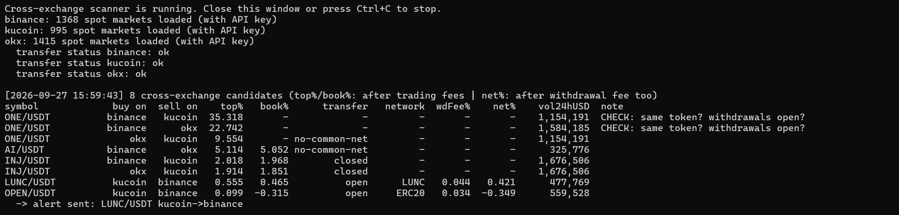
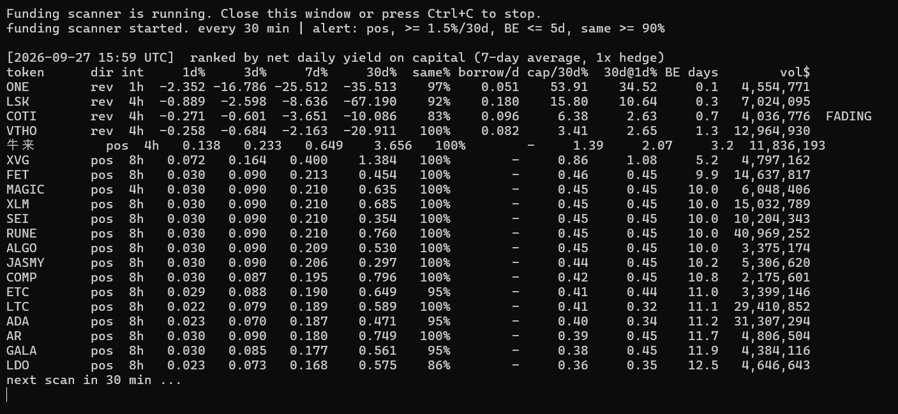
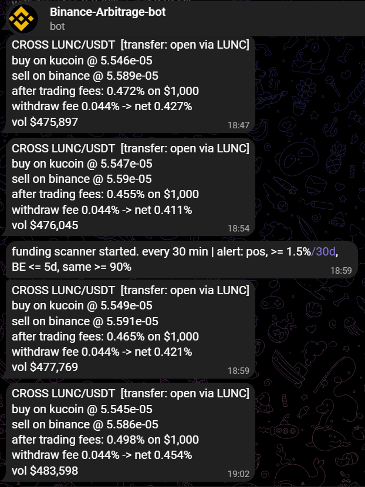

# Crypto Arbitrage Scanners

Real-time scanners that look for arbitrage opportunities on **Binance, KuCoin, OKX and Bybit**, check whether they are actually executable, and send alerts to **Telegram**.

They never place orders. They find, verify, log and notify.

  

---

## What's inside

| Tool | Strategy | What makes it different |
|---|---|---|
| `arb_scanner.py cross` | Same pair, different exchanges | Checks **deposit/withdraw status**, finds a **common network**, compares **token contract addresses** and subtracts the **withdrawal fee** before alerting |
| `arb_scanner.py tri` | Triangular arbitrage inside one exchange | Auto-builds **every triangle** from all markets and uses **your real per-pair fees** (incl. zero-fee pairs) |
| `funding_scanner.py scan` | Funding-rate carry (spot vs perpetual) | Ranks by **realised** 1/3/7/30-day funding, not the headline APR; subtracts margin **borrow interest**; flags **fading** rates |
| `funding_scanner.py watch` | Exit monitor for open positions | HOLD / WEAKENING / EXIT signals sent to Telegram |

Every opportunity is re-checked by **walking the real order books** with a configurable size (e.g. $1,000), so thin top-of-book "opportunities" are filtered out.

## screenshots

| Cross-exchange scan | Funding scan | Telegram alert |
|---|---|---|
|  |  |  |

## Quick start

```bash
git clone https://github.com/<charlie-hk>/crypto-arbitrage-scanners.git
cd crypto-arbitrage-scanners
pip install -r requirements.txt

# cross-exchange gaps, rescan every 60 s
python arb_scanner.py cross --exchanges binance kucoin okx --loop 60

# funding-rate opportunities, rescan every 30 min
python funding_scanner.py scan --keys --loop 1800

# watch an open position and alert on exit conditions
python funding_scanner.py watch BTC:pos --keys
```

On Windows you can simply double-click the launchers in `scripts/`. They restart the scanner automatically if it stops.

## Configuration

All secrets come from **environment variables**, never from the code. See `.env.example`.

| Variable | Needed for |
|---|---|
| `BINANCE_API_KEY`, `BINANCE_SECRET` | real fees, margin borrow rates, transfer status |
| `OKX_API_KEY`, `OKX_SECRET`, `OKX_PASSPHRASE` | transfer status on OKX |
| `KUCOIN_API_KEY`, `KUCOIN_SECRET`, `KUCOIN_PASSPHRASE` | transfer status on KuCoin |
| `TELEGRAM_TOKEN`, `TELEGRAM_CHAT_ID` | Telegram alerts |

Use **read-only** keys. The scanners never need trading or withdrawal permissions.

## How it works

**Cross-exchange**

1. Fetches all spot tickers from each exchange in one request per exchange.
2. For each shared pair, computes buy-on-A / sell-on-B profit after taker fees on both sides.
3. For the best candidates: walks both order books with the chosen size, then checks withdraw on A and deposit on B for a **common network** with a **matching contract address**, and subtracts the network's withdrawal fee.
4. Alerts only when the route is open and still profitable after all fees. Gaps above 10% are flagged as suspicious and never alerted.

**Triangular**

For a cycle `Q1 -> X -> Q2 -> Q1` the final amount is

```
final = 1 / ask(X/Q1) * (1 - f1) * bid(X/Q2) * (1 - f2) * rate(Q2 -> Q1) * (1 - f3)
```

The scanner builds every such cycle from the exchange's market list, in both directions.

**Funding carry**

- `pos`: buy spot + short perpetual, collects positive funding.
- `rev`: borrow & sell spot + long perpetual, collects negative funding minus borrow interest.
- Yield on capital assumes a 1x hedge (capital split across both legs). Break-even days = round-trip fees / net daily funding.

## What the data showed

Running these scanners on live markets (September 2026) gave some useful, if unglamorous, results:

- **Triangular arbitrage** on Binance, KuCoin and OKX: the best cycles were within about one price tick of break-even *before* fees. At retail fee levels it is effectively closed.
- **Large cross-exchange gaps** (2 to 8%) almost always had a closed deposit/withdrawal or no common network. The transfer-status check is what separates real opportunities from noise.
- **Real executable gaps** do appear occasionally, typically 0.1 to 0.3% after all fees.
- **Funding carry** is the most consistent of the three, but headline APRs are extrapolated from the last few days and fade quickly.

## Disclaimer

For research and education. Not financial advice. Past funding rates and price gaps do not guarantee future results. Transfers take time and prices move. Use at your own risk.

## Custom work

I build custom trading tools: crypto scanners and bots (ccxt, exchange APIs, Telegram), and MetaTrader 5 Expert Advisors and indicators.

Contact: `<https://t.me/Charlie_hk1>`
